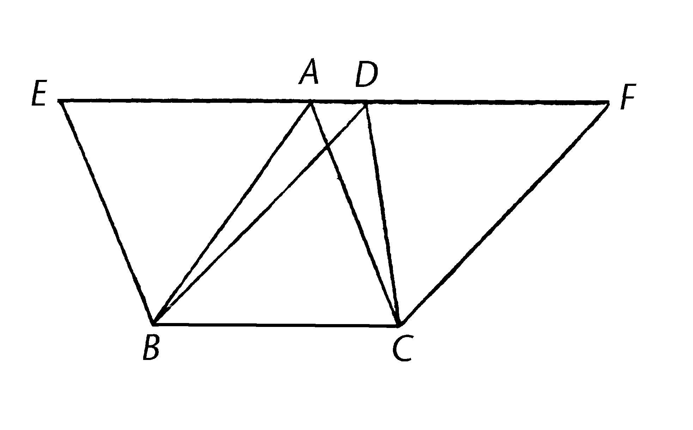

# 《欧几里得》第一卷 命题

## 工具：圆规和直尺 {-#instruments}

 古希腊的几何学者设计了圆规和直尺以用来进行几何构建。这些工具都是关键，不仅是对于执行绘画(的动作)，还是理解欧几里得在构建过程中的描绘。今天，他们能被轻易的找到，在出售办公用品和学校文具的地方。
 
 直尺是没有任何标记的尺子，用于指引铅笔来画两点之间的直线或者其它所需要的。
 
 几何学者的圆规和画在此书封面的工具相似，他有两只腿，其中一个的末端止于非常尖锐的一个点，可以固定在纸上，也就是在绘图过程中被视为点（圆心）的地方，另一条腿止于铅笔，被用来画弧线或者圆。（书的封面似乎用的是粉笔而不是铅笔）
 
 两只腿被分开的距离就是所需的圆的半径。然后圆规被旋转来画弧或者圆，或者在某线上截断指定距离。这会使你画一个有指定半径的圆或者起于一点在某线上截断指定距离。
 
 圆规和直尺会允许我们在物质的现实中实现前三个公设原本要求我们在脑海中进行的构建。（接下来），你会立刻在第一个命题中使用这些工具：用圆规画指定半径的圆，并且用直尺连接点。

## 学习命题指南 {-}

这里有一些参与和完成命题的提示和指导。千年以来，学习欧几里得被视为教人们如何思考的一个有价值甚至是范式的工具。无论是在教室，和一个或两个朋友结为学习伙伴，或者只是为了乐趣，以下实践会帮助实现它的价值：

 - 在你的准备过程中，当你第一次设法完成书中所示的步骤时，在你自己的纸上写出命题的每一步。这时你会用到圆规，铅笔和直尺。（看前文关于这些核心工具的更多说明）如果你是在课堂中，这会帮你准备在全班面前不带书地在黑板上论证命题。如果你是独自学习，展示证明如同亲自论证这个非常有价值的练习还是值得完成。你在纸上或黑板上向想象中的听众“展示”证明。
 
 - 如果你在教室的黑板前并且给予自己的论证*，你是在向你的同学证明命题。鼓励他们质疑你并且对证明的步骤提出问题。如果你的准备允许你解释步骤到让同学满意的程度，那么你进行了表达逻辑思考的好的练习。如果你发现有效的异议，认识到它并且通过和其它共同学习者的讨论，察看你是否能至少深入理解问题所在。在这种情况下，你在思考没有直接或简单答案的问题上得到了好的练习。
 
 - 一般情况下，当你在黑板前论证任意一步时，将“欧几里得说”这个表达视为非法的。你希望的是你的证明。但是如果你已经尽最大努力尝试去理解证明，并且研习中详细地写下步骤和绘制图像，但始终有一步你无法跟随（逻辑），在这个时候你可以在黑板前说“这里欧几里得说”并且像你的同学们寻求帮助。如果是他人在展示并且到了这个你在准备中觉得很难的一步，仔细听他是在黑板前如何解释的，如果并不令你满意，提问并且质疑。也许小组中的另外一人会提供有益的见解，或者广泛的讨论可以揭示其中的逻辑以满足所有人，或给所有人继续研习此书程中留下一个问题。
 
 - 当你准备论证命题时问自己以下问题：
 
 	- 什么时候我认可了这个命题已被证明？是什么形成了一个逻辑上令人信服的论据？这里有确定性么？
 	
 	- 寻找以下两者的区别：一步一步地跟随并确认每一步都遵循着上一步；仔细考虑图像并且对这个命题整体为真有所感觉。也许这个感觉是清晰并正确的直觉，但也许只是看似合理的，有谬误的。这种知识彼此有什么不同呢？
 	
 	- 为什么欧几里得用他证明的方式来证明命题？用之前的已证为基础，还有其它的方式可以证明么？还有更简单的方式么？还是说更简单的方式需要一些还没有被证明或者假定的假设？你能够想到一些之前通过常识或感觉或早期几何课学到的什么，并应用在这儿么？怎么样你才能够避免你自己，或者你黑板前的同学，错误的应用这些内容（常识、早期知识）呢？
 	
 - 不断记录新出现的问题。这可以包括你或同学在黑板前论证时出现的问题并始终让人困惑的问题。后续会为之前的问题提供线索。如果你是在课堂中学习，可能被布置论文、随笔测试，这时最好就写一个你已经思考很久的问题。你会阐明自己学习中一个思考的过程，而不是写一个已经存在的形式或者只是汇报欧几里得说的话。周期性地回到问题中并且观察你自己的思考如何发生了变化。你脑海中可能有很多小随笔，观察你理解的变化已经很让人满足了。
 
 - 你是课堂教师么？你会有自己的情况，关于时间的限制。但是理想的总目标还是平衡论证和讨论的时间：使学生尽可能频繁地站起来在黑板前论证*，同时同学提出必要的质疑和提问，并且让小组讨论提出的那些更大的问题。取决于你想在这本书上花多久时间，你可能想在最后布置论文，可能是让学生自己选一个他们觉得有趣的主题。小的当堂测试或者在家的随便测验也是不错的选择。当然你也有自己的想法。比如说，你可以给学生们一道缺少步骤的证明题，让他们自己发现少的那步。（宣棋注：这里的“论证”并不是指自己用其它的方式论证同样的声明，而是说不回顾书本的情况下，独立还原欧几里得的所有论证步骤。）
 
## 命题一
**在一条有限的直线上构建一个等边三角形。**

```{r echo=FALSE, out.width='40%'}

```

 设AB是给定的有限直线。
 
 那么需要在直线AB上构建一个等边三角形。以A为圆心，AB为距离，画圆BCD。【公设3】
 
 再一次，以B为圆心，BA为距离，画圆ACE；【公设3】并且从点C，两圆相交的地方，到点AB，连接线段CA, CB. 【公设1】
 
 现在，因为点A是圆CDB的圆心，所以AC等于AB。【定义15】
 
 再一次，因为点B是圆CAE的圆心，所以BC等于BA。【定义15】
 
 但是CA已被证明相等于AB，所以线段CA,CB都等于AB。
 
 而且与同一事物相等的事物彼此互等【公理1】；所以CA等于CB。
 
 所以三条线段CA, AB, BC彼此之间互等。
 
 所以三角形ABC是等边三角形，并且它是被构建在指定的线段AB上。
 
 这就是被要求作的。
 
问题示例：

 “并且从点C，两圆相交的地方”： 我们如何知道两圆会相交？
 
 我们如何知道两圆相交在一点？
 
## 命题二
**由给定一点[作为端点]作一线段，使与一给定线段相等。**

```{r echo=FALSE, out.width='30%'}

```

 使A作为给定一点，BC为给定线段。
 
 那么要求由给定一点A（作为端点）作一线段，使与线段BC相等。
 
 从点A到点B，连接线段AB。【公设1】并且在其上构建等边三角形DAB。【I.1】
 
 延长DA,DB至直线AE,BF. 【公设2】
 
 以B为圆心，BC为距离，画圆CGH；【公设3】
 
 且再一次，以D为圆心，DG为距离，画圆GKL。【公设3】
 
 那么，因为B是圆CGH的圆心，所以BC等于BG。
 
 再一次，因为D是圆GKL的圆心，所以DL等于DG.
 
 且其中DA等于DB；所以余量AL等于BG。【公理3】
 
 但是已证明BC等于BG；所以AL,BC分别等于BG。
 
 而且与同一事物相等的事物们彼此互等【公理1】；所以AL等于BC。
 
 所以由给定点A，作线段AL，等于给定线段BC。
 
 这就是被要求作的。
 
 [编者注：这里是Heath提供的，增添以作说明，其实并没有呈现在古希腊语原文中。]
 
## 命题三
**给定两条不等线段，从长的线段中截取一条线段，使等于短的线段。**

```{r echo=FALSE, out.width='30%'}

```

 设AB,C为两条给定不等线段，AB为长的那条。
 
 那么需要从长线段AB中截取线段与短线段C相等。
 
 从点A取AD等于线段C；【I.2】并且以A为圆心，AD为距离，画圆DEF【公设3】
 
 现在，因为A是DEF的圆心，所以AE等于AD 【定义15】
 
 但是C也等于AD,
 
 所以线段AE,C与AD互等；所以AE也等于C。【公理1】
 
 所以，给定的两条线段AB,C，从长线段AB中，已截取AE与短线段C相等。
 
 这就是被要求作的。
 
问题示例：

 - 你有好奇为什么欧几里得的第一步是展示如何构建一个等边三角形么？你有发现命题2关于点A和随机线段BC有些奇怪？现在你在的位置可以感受到愉悦，因为你看到了他是如何小心翼翼地构建他的系统。他用公设和公理证明了命题一，用公设、公理以及命题一，他证明了命题二。现在，用命题二（还有公设3以及公理1），他是不是，通过不相等的线，证明了一个会对处理大小问题有用的事物呢？
 
 - 公理3说我们可以以任何圆心和距离画圆。那么，为什么我们不能仅仅用距离C作为给定距离和线段AB的其中一个端点呢？为什么我们需要命题2，是因为在公理3中，我们有给定的举例，而在命题3中，我们只有一个线段么？
 
 【宣棋注：greater/less 在中文中，视情况翻译成多少，大小，长短。】
 
## 命题四
**如果两个三角形中两条边互等【】，并且这些互等的边所夹的角也相等，那么他们的底边也互等，三角形全等，剩余的等边所对的角也互等。**

```{r echo=FALSE, out.width='50%'}

```

 设三角形ABC和DEF中，AB，AC分别与DE，DF相等，即AB与DE，AC与DF，并且角BAC等于角EDF。
 
 我说底边BC也等于底边EF，三角形ABC全等于三角形DEF，并且剩余的等边对的角也各自互等，也就是角ABC等于角DEF，角ACB等于角DFE。
 
 因为，如果将三角形ABC放置在三角形DEF上，如果点A放在点D上，线段AB放在DE上，那么点B会与E重合，因为AB等于DE。
 
 再一次，因为如果AB重合DE，那么线段AC重合DF，因为角BAC等于角EDF;
 
 所以点C也重合于点F，因为AC等于DF。
 
 但是B也重合于E，所以底边BC也重合底边EF，并且与之相等。 【公理4】
 
 所以整个三角形ABC重合于整个三角形DEF，并且与之相等。【公理4】
 
 而且剩余的角也各自重合和相等。角ABC和角DEF，角ACB和角DFE。 【公理4】
 
 综上所述…*
 
 Q.E.D.
 
 *编者注：“综上所述…”以及关于Q.E.D. 和Q.E.F.的缩写已在前文中解释。
 
 【宣棋注1：这里指的是，其中一个三角形的两边与另一个三角形的两边分别相等】
 
 【宣棋注2：在原文中，并没有三角形“全”等的“全”这个词，是为了和中文中的术语保持一致，决定这么翻译。这个命题就是几何中由SAS证全等的由来。】
 
问题示例：

 - 前三个命题是关于做的事情。现在我们转移到了许多论证事情的命题中的第一个。你如何看待这里的不同：探究方法、策略、语言？
 - 这是他第一次在陈述声明之后说“我说…”。 为什么他在论证之间说这个？是因为在之前的命题中，他断言了独立于他的真理么？而且这样做，你就会拥有真理。而在这个还有之后的命题里，他对声明的陈述以及提出论据负有责任？通过这样的做法，在你看到论证的最后，被说服之前，是都不需要相信他的么？
 - 这里是断言面积相等的首次出现。（“三角形全等”，并且我们知道图形是被边界围成的）通过这本书，欧几里得将要建立更多关于面积相等复杂的论断。
 这里的基石是重合，根据公理4彼此重合的事物相等。在建立体系的此处，我们已经用到了简单的前三条算术公理，现在则是公理4，有些不同的重合准则。之后，我们也会调用已定义（定义十）和假设（假设四）的直角相等性。
 - 这也是第一个关于一致性的证明。你能想到其它无需重合，证明面积、剩余的角、还有底边相等的方法么？
 - 我们怎样才能知道这些三角形、点、线段、角可以彼此重合呢？我们不能把三角形拾起然后放到另一个上面。你怎么看待他的论据，关于他在脑海中将点放置重合，然后放线段和角重合？逐步做这个可以避免想象中的怪异——我们可以在不改变三角形的情况下拾起并且移动它？
 - 如果这个结论是承接着公理4，为什么我们需要这个命题？仅仅是因为我们要展示它们彼此重合？如果是这样的话，我们需要更仔细的察看措辞：每一步的已知和所求。
 - 这些步骤本身需要授权么？特别是当他说B与E重合因为它们长度相等时？这些步骤确实看起来可以被立刻推论，但事实上线段不重合是很难想象的。如果他们不重合的话，两条线段就会围成一个空间。你能通过组合先前的元素，比如定义4，公设1和2，还有公理4，从逻辑推导出线段的重合么？或者说这里还是缺少了什么？
 - 也有人建议说欧几里得应该将卷一命题命题四作为一个假设。你认为欧几里得为什么始终将此作为一个命题？
 - 如果允许拿起某物并且移动它，在前三个命题中，为什么我们不能拿起那些线段并且移动他们呢？他们的情况有何不同？或者说只是欧几里得对他的方法感到不适，并且只会在别无选择时这样做？（后面仅有两个地方会呈现：卷一命题4和命题8）
 - 那么我们能否确认三角形在被移动的过程中不会发生改变？而且当我们已经确定两个叠加的三角形全等，如何将其拓展到那些不叠加的三角形？
 
## 命题五
**在等腰三角形中，两底角互等，并且如果两腰继续延伸，底边下的两角也互等。**

```{r echo=FALSE, out.width='25%'}

```

 设等腰三角形ABC中边AB等于AC；设直线BD,CE是AB,AC同直线的延伸。【公设2】
 
 我说角ABC等于角ACB，并且角CBD等于角BCE。
 
 在BD上任取一点F，从长线段AE上截取AG，使之等于短线段AF;【I.3】并且连接线段FC,GB。
 
 那么，因为AF等于AG，AB等于AC，两条边FA,AC各自与两条边GA,AB相等；并且他们包含一个共同的角FAG。
 
 所以底边FC等于底边GB，三角形AFC全等于三角形AGB，并且和剩余的各等边相对的角也各自相等，也就是说角ACF等于角ABG，角AFC等于角AGB。【I.4】
 
 且因为作为整体，AF等于AG，其中AB等于AC，那么剩余的部分BF等于CG。
 
 但是FC也被证明与GB相等，所以两条边BF,BC与另两条边CG,GB互等；角BFC等于角CGB，同时BC是公共的底边；所以三角形BFC也全等于三角形CGB，并且剩余等边所对的角也各自相等，所以角FBC等于角GCB，角BCF等于角CBG。
 
 相应的，因为作为整体的角ABG已被证明等于角ACF，其中角CBG等于角BCF，剩余的部分角ABC等于剩余的部分角ACB；并且他们在三角形ABC的底边上。
 
 但是角FBC已被证明等于角GCB，且他们在底边下。
 
 综上所述…
 
 Q.E.D.
 
问题示例：

 - 这是否让人惊讶：他先证明了第二部分？你是否曾期待用更明显的事实——底边内两角相等，作为基石证明底边两外角相等，而不是相反的方式？这个简单的例子也许已经暗示了独辟蹊径的创造力可能会被用于证明更复杂的命题。
 【宣棋注：这个问题是问我们是否对先证明底边下两角相等再证明两腰所对相交互等感到惊讶。】
 
## 命题六
**如果三角形中两角互等，那么两角各自对应的边也互等。**

```{r echo=FALSE, out.width='25%'}
knitr::include_graphics('./image/img458.jpg')
```

 设三角形ABC中角ABC等于角ACB; 我说边AB等于边AC。
 
 因为如果AB不等于AC，他们其中之一会更长。
 
 设AB更长；在长线段AB中截取DB，使之与短线段AC相等；连接DC。
 
 那么，因为DB等于AC，并且BC是公有的，两边DB,BC各自与两边AC,CB互等，并且角DBC等于角ACB；所以底边DC等于底边AB，且三角形DBC与三角形ACB全等，小的等于大的：这是不合逻辑的。
 
 所以AB不能不等于AC；所以两者相等。
 
 综上所述…
 
 Q.E.D.
 
问题示例：

 - 我们如何知道三角形BDC比三角形BAC小？因为那儿并没有详细的步骤证明它，我们可以依据可以看到的绘画么？
 - 这个命题介绍了一种新的论证技巧，“reductio ad absurdum” （reduction to absurdity，归谬法）。如果我们不能找到一个方式直接证明某事，我们可以做相反的假设，然后看是否会引起一个矛盾。
 - 在这个题中，你能直接证明这个声明么？
 - 对你来说，归谬的方法是否和直接证明一样有说服力？
 - 在假设相反情况的时候，会不会有可能的失误或者谬论？会是什么呢？在哪些方面我们应该特别留意？
 - 如果这里有不止你想证明的那一种情况，你如何才能知道你已经排除了其它可能性？在这个题中，其它的可能性是什么？
 - 这个证明依赖于公理5“整体大于部分”吗？
 - 此命题与命题I.5的第一部分相反。你认为为什么他没有收录关于第二部分相反的证明？因为他不需要么？（之后他不会用到那个性质？）还是因为如果需要的话，读者们可以轻松地自行证明它？
 
## 命题七
**在同一条直线（由它的两端点），构建会在同一点相交的给定两线段，那在同一条直线上（由两端点），在同一侧，不能构建出交于另一点的另两条线段，使之与之前的两线段相等，即分别到每个端点的线段。**

```{r echo=FALSE, out.width='30%'}

```

 因为，如果可能的话，给定在直线AB上构建的两线段AC,CB交于点C，设其它两线段AD,DB构建在相同的直线AB的同一侧上，交于另一点D，并且与之前的两线段相等，也就是彼此到相同的端点，所以CA等于DA，有共同的端点A，而且CB等于DB，有共同的端点B，连接CD。 
 
 那么，因为AC等于AD，角ACD也等于角ADC；【I.5】那么角ADC大于角DCB；那么角CDB大于角DCB。
 
 重复地，因为CB等于DB，角CDB也等于角DCB 。
 
 但是已经证明了它更大：这是不可能的。
 
 综上所述...
 
 Q.E.D.
 
问题示例：

 - 另一个reductio（归谬），我们被“如果可能的话…”所警醒！我们一共有多少种其它选择？可能的和不可能的？各种“不可能的”配置重要么？
 - 这里是否还有其它情况会改变证明中的步骤？绘画中显示AC是边AC和CB中较长的，所以D落于CB之外。如果AC是较短的边呢？那么绘画会是什么样子？如果他们相等呢？
 - 从公设的问题示例开始，我们思考通过绘图学习和通过逻辑学习的关系。公设是关于能画的，我们已有的和将有的命题，关于图像的构建，暗示着绘画至少在某种程度上对这个项目时很关键的。
 - 但是，等一下！绘画会不会产生误导？如果图像只能显示一种情况，但可能有多种呢？比如说，假定图像显示线相交于一边，且命题对这种情况是有效的，但是完成的构建是在另一边或者根本没有相交。
 - 如果这里还有其它情况，为什么欧几里得没有将他们囊括以作为证明的一部分呢？是否欧几里得只给予一种情况，且将剩余（有类似逻辑或者更简单的情况）留给读者，因为这是不需要讲出的？你能够草绘出其它情况的证明并且确认他们也会出现“不可能的”结果么？
 
## 命题八
**如果两个三角形分别有两边各自对应相等，并且底边也互等，那么被等边夹的角也互等。**

```{r echo=FALSE, out.width='50%'}
knitr::include_graphics('./image/img464.jpg')
```

 设三角形ABC,DEF分别有两边AB,AC等于DE,DF，其中AB等于DE,AC等于DF；并且设底边BC等于底边EF；我说角BAC等于角EDF。
 
 因为，如果三角形ABC放置到三角形DEF，如果点B被放到点E，且直线BC到EF，点C也会与F重合，因为BC等于EF。
 
 那么，BC重合于EF，BA,AC也重合于ED,DF；因为，如果底边BC重合于底边EF，并且边BA,AC不重合于ED,DF却像EG,GF一样落于一旁，那么，在同一条直线（由它的两端点），构建会在同一点相交的给定两线段，那在同一条直线上（由两端点），在同一侧，构建出了交于另一点的另两条线段，使之与之前的两线段相等，即分别到每个端点的线段。
 
 但是两线段不能被如此构建。【I.7】
 
 所以，如果底边BC放置到底边EF上，边BA,AC不重合于ED,DF，这是不可能的；所以他们重合，角BAC也重合于角EDF，并且互等。
 
 如果，综上所述...
 
 Q.E.D.
 
问题示例：

 - 与命题I.4不同的是，I.8并没有以一个明确的陈述两三角形全等来结尾。我们应该想要它么？你是否能看到I.4在I.8中的建立角和边的应用是如何显示三角形全等的?
 - 我们是否感觉到了欧几里得相较于无懈可击的像机器一样的公理系统的不同方法？是因为欧几里得认为他的读者是人类所以不需要点每个i和划每个t么？**
 - 你是否掌握了证明中关于叠合的线索？叠合的三角形是那些所有对应的边和角都相等的（由此可推它们面积也相等）。叠合的三角形也是未来证明中构建块的关键，但随着我们继续开发这个架构，似乎任意等边和等角都会使得三角形叠合。到目前，关于叠合的证明我们有哪些？使用速记键，譬如SAS（边角边）或SSS（边边边）会有所帮助。
 - 此证明与I.4所运用的策略有什么共同之处么？
 
## 命题九
**将给定的直线角平分。**

```{r echo=FALSE, out.width='30%'}

```

 设角BAC是给定的直线角。
 
 那么要求将它一分为二。
 
 设在AB上随意取一点D；从AC上截取AE，使等于AD，连接DE，并且在DE上构建等边三角形DEF，连接AF。
 
 我说角BAC被直线AF一分为二。
 
 因为AD等于AE, 且AF是共有的，那么两条边DA,AF分别等于两边EA,AF。
 
 并且底边DF等于底边EF；所以角DAF等于角EAF。
 
 所以给定的直线角BAC被直线AF一分为二。
 
 Q.E.F.

问题示例：

 - 在这里我们将一个角平分，在下一个命题里，我们会将一条直线平分。你会期望线的分割线更容易么？在欧几里得建造的体系中，哪一部分要求平分角被首先展示出来？
 - 比较古希腊语…….在定义17中的运用，也就是直径将圆平分（或一分为二）。那儿我们质疑断言的权威性，即翻译“平分”隐含着将圆切割成相等部分。这儿平分的意图则是毫无异议的，并且结果也确实被合理地论证了。
 - 为什么欧几里得没有定义“平分”？一部分等于另一部分就足够了么，还是一定要说这些部分能够构成一个整体？许多事物看起来并不清晰，这是个问题么？还是说我们完全知道将一个整体切成两相等部分的含义就已经足够好了？
 
## 命题十
**将给定的线段平分。**

```{r echo=FALSE, out.width='30%'}

```

 设AB是给定的线段。
 
 所以要求是将线段AB平分。
 
 在其上做等边三角形ABC【I.1】并让角ACB被直线CD平分【I.9】我说直线AB在点D被平分。
 
 因为AC等于CB，且CD是公有的，两边AC,CD分别各自等于两边BC,CD；且角ACD等于角BCD；所以底边AD等于底边BD。【I.4】
 
 所以给定的线段AB被平分在D。
 
 Q.E.F.
 
问题示例：

 - 我们是否知道平分一条线是可能的？这是否将我们带回之前关于第一和第二条定义的问题？线是没有宽度的长度，但这是由何构成？如果这是由那些特别小的不可分割的微量构成，那么一条由奇数个微量构成的直线是不能被一分为二的。能被一分为二这个特性告诉了我们关于线的什么本质呢？
 - 欧几里得有将部分论证与图像交流么？或许关于平分的想法？所有事物都可以口头表达么？绘画是表达你想法重要一面的正当方法么？有的人会说“口头表达和绘画都仅仅是帮助我们思考的工具。但是我们没有在思考言语或者图像。”你认为这样的说法正确么？
 - 这些事物和自然世界的关系是怎样的？假设你正在用几何的命题划分田野。在言语和绘画的基础上，这些应用能作为第三个工具么？这个范例能帮助我们思考数学的理想化么？它能帮我们提升前文中讨论到的柏拉图分割线么？
 
## 命题十一
**在给定直线的给定点上，画一直线与给定直线呈直角。**

```{r echo=FALSE, out.width='40%'}

```

 设AB为给定直线，且C是其上一给定点。
 
 所以要求从点C画一直线与直线AB呈直角。
 
 在AC上设任意一点D；作CE使等于CD;【I.3】在DE上构建等边三角形FDE，【I.1】并且连接FC；我说直线FC与给定的直线AB呈直角且起于给定点C。
 
 因为DC等于CE，并且CF是公有的，两边DC,CF各自与两边EC,CF互等；且底边DF等于底边FE；所以角DCF等于角ECF; 【I.8】且他们是相邻角。
 
 但当一条直线置于另一条直线上，并使得两个相邻角互等，每个角都是直角；【定义十】所以DCF,FCE都是直角。
 
 所以在给定直线AB的给定点C上作的直线CF与AB呈直角。
 
 Q.E.F.
 
## 命题十二

**给定一无限直线，在线外一给定点上，画垂线。**

```{r echo=FALSE, out.width='40%'}

```

 设AB是给定的无限直线，C是线外的一点；所以要求是在给定的无限直线AB外的C上画垂线。
 
 在AB的另一侧取任意一点D，并以C为圆心，CD为距离，画圆EFD；【公设3】在H平分直线EG，【I.10】并连接直线CG,CH,CE。【公设1】
 
 我说CH是由给定无限直线AB外的C上所画垂线。
 
 因为GH等于HE, 且HC是公有的，两条边GH,HC各自与两边EH,HC互等；且底边CG等于底边CE；所以角CHG等于角EHC。【I.8】
 
 并且他们是相邻角。
 
 但是，当一条直线置于另一条直线上，并使得两个相邻角互等，每个角都是直角，置于另一条直线上的这条直线被称为垂直于另一条直线。【定义10】
 
 所以CH是由给定无限直线AB外的C上所画垂线。
 
 Q.E.F.
 
问题示例：

 - 为什么线必须是无限的？在这里无限的含义是什么？

## 命题十三
**如果将一条直线置于另一条直线上成夹角，要么成两直角，要么与两直角相等。**

```{r echo=FALSE, out.width='40%'}

```

 对于设直线AB在CD上成夹角CBA,ABD; 我说角CBA,ABD或者是两直角，或者等于两个直角。
 
 现在，如果角CBA等于角ABD，他们是两个直角；【定义10】  
 
 但是，如果不是的话，从点B画BE与CD成直角。【I.11】所以角CBE,EBD是两直角。  
 
 那么，因为角CBE与角CBA,ABE相等，再各自加上角EBD；所以角CBE,EBD与三个角CBA,ABE,ECD相等。【公理2】  
 
 再一次，因为角DBA与角DBE,EBA相等，再各自加上角ABC；所以角DBA,ABC与三个角DBE,EBA,ABC相等。【公理2】  
 
 但是，角CBE,EBD已被证明相等于同样的三个角；且与同一事物相等的事物们彼此互等；【公理1】所以角CBE,EBD也等于角DBA,ABC。  
 
 但是角CBE,EBD是两个直角；所以角DBA,ABC也等于两个直角。
 
 综上所述…  
 
 Q.E.D.  
 
问题示例：  
 
 - 这儿是对定义十的应用：因为我们证明了角是相等的，通过定义十我们知道有两个直角。那儿我们说了这是我们将称为直角的角。（当我们仔细考虑公设4的时候，需要重新思考这一点。）现在当我们应用在这个命题时，看起来合理么？
 
## 命题十四
**如果在任意直线的一点上，有两条直线不在同一侧，且使得所成相邻角等于两直角，则这两条直线在同一直线上。**

```{r echo=FALSE, out.width='40%'}
knitr::include_graphics('./image/img477.jpg')
```

 对于在任意直线AB上的点B，使BC,BD落在不同侧使得相邻角ABC,ABD等于两直角；我说BD和CB在同一直线上。
 
 因为，如果BD和BC不在同一条直线上，使BE在CB在同一条线上。
 
 那么，因为直线AB在直线CBE上，角ABC,ABE等于两直角【I.13】
 
 但是角ABC,ABD也等于两直角；所以角CBA,ABE也等于角CBA,ABD。【公设4和公理1】
 
 将角CBA从各自中减去；所以剩余的角ABE等于剩余的角ABD，【公理3】小的等于大的：这是不可能的。
 所以BE和CB不在同一直线上。
 
 同样地，我们可以证明除BD外，没有其它直线和CB在同一直线上。
 
 所以CB和BD在同一直线上。
 
 综上所述…
 
 Q.E.D.
 
问题示例：

 - 你能在不引用公设4所有直角都相等的情况下完成这个论证么？（这个问题同样适用于命题15）
 
## 命题十五
**如果两直线相交，他们所成的对顶角互等。**

```{r echo=FALSE, out.width='40%'}

```

 设直线AB,CD相交在点E；我说角AEC等于角DEB，且角CEB等于角AED。
 
 因为直线AE在直线CD上，并成夹角CEA,AED，角CEA,AED等于两直角。【I.13】
 
 因为直线DE在直线AB上，并成夹角AED,DEB，角AED,DEB等于两直角。【I.13】
 
 但是角CEA,AED也已被证明与两直角相等；所以角CEA,AED等于角AED,DEB.【公设4和公理1】
 
 将角AED从各自中减去；所以剩余的部分角CEA与BED互等。【公理3】
 
 类似地，可以证明角CEB,DEA也互等。
 
 综上所述…
 
 Q.E.D.
 
**推论** 「由此，显然的，如果两直线相交，它们之间在交点所成的角等于四个直角。」

编者注：在此及本书其它地方的「」用于指明被学者们认为是早期编辑文本添加的内容，也就是说非最初欧几里得给出的。其中一部分假定为添加的内容被Heath还有我们（以「」的形式）保留下来，是因为他们已经被包含在了在重要的古希腊语文本中很久，他们具有准-欧几里得的地位。现在的推论已展现在Proclus（公元410-485年）时期的手稿中。关于推论的含义，查阅[前文](#plato)。

## 命题十六
**在任意三角形中，如果延长其中一边，那么外角大于内对角。**

```{r echo=FALSE, out.width='30%'}

```

 设ABC为三角形，并将其中一边BC延长至D；我说外角ACD大于内对角CBA和角BAC。
 
 将AC在E平分，【I.10】并连接BE且在同一条直线上延长至F；使得EF等于BE，【I.3】连接FC，【公设1】并画AC到G。【公设2】
 
 那么，因为AE等于EC，BE等于EF，两边AE,EB各自与两边CE,EF互等；且角AEB等于角FEC，因为它们是对顶角。【I.15】
 
 所以底边AB等于底边FC，三角形ABE全等于三角形CFE，且剩余的各等边对应的角也各自相等；【I.4】所以角BAE等于角ECF。
 
 但是角ECD比角ECF大；【公理5】所以角ACD大于角BAE。
 
 类似地，如果平分BC，角BCG，也就是角ACD【I.15】可以被证明比角ABC大。
 
 综上所述...
 
 Q.E.D.
 
问题示例：

 - 我们如何知道CF会落在角ACD以内？
 - 你是否有注意到在搭建线和角的性质时，欧几里得有多么的仔细？现在，他从搭建的线和角中移到三角形，探讨边和角的关系。注意看他是如何发展三角形的这些特性的。你能够看到这些关系的多样性的是如何丰富的？他正在指引我们变得能够绘出关于平行线和相等面积的结论。
 
## 命题十七
**在任意三角形中，以任意方式取任意两角，其两角（之和）小于两直角。**

```{r echo=FALSE, out.width='50%'}
knitr::include_graphics('./image/img483.jpg')
```

 设ABC为三角形，我说在三角形ABC内以任意方式取任意两角，其两角（之和）小于两直角。
 
 延长BC到D。【公理2】
 
 那么，因为角ACD是三角形ABC的外角，它比内对角ABC大。【I.16】
 
 各自添加角ACB；所以角ACD,ACB比角ABC,BCA要大。
 
 但是角ACD,ACB等于两直角。【I.13】
 
 所以角ABC,BCA小于两直角。
 
 类似地，我们可以证明角BAC,ACB也比两个直角小，角CAB,ABC也是同样的情况。
 
 综上所述...
 
 Q.E.D.
 
## 命题十八
**在任意三角形内，长边对大角。**

```{r echo=FALSE, out.width='40%'}
knitr::include_graphics('./image/img485.jpg')
```

 设ABC是边AC比边AB长的三角形；我说角ABC比角BCA大。
 
 因为AC比AB长，作AD使等于AB【I.3】，且连接BD。
 
 那么，因为角ADB是三角形BCD的外角，它比内对角DCB大。【I.16】
 
 但是角ADB等于角ABD，因为边AB等于边AD；所以角ABD大于角ACB；角ABC更大于角ACB。
 
 综上所述...
 
 Q.E.D.
 
## 命题十九
**在任意三角形中，大角对长边。**

```{r echo=FALSE, out.width='30%'}

```

 设ABC是角ABC比角BCA大的三角形；我说边AC比边AB长。
 
 如果不是的话，AC或等于或小于AB。
 
 现在AC并不等于AB；因为那样的话角ABC应该等于角ACB；【I.5】但是并不是，所以AC并不等于AB。
 
 AC也并不小于AB，因为因为那样的话角ABC应该小于角ACB；【I.5】但是并不是，所以AC并不小于AB。
 
 因为已证明它们也并不相等。
 
 所以AC大于AB。
 
 综上所述...
 
 Q.E.D.
 
问题示例：

 - 这是前一个命题的逆命题。逆命题需要被证明么？逆命题有时是错的么？
 - 这个证明用到了归谬，他有辨别出所有的其它可能性么？
 - 你是否能用I.18和I.5做一个直接的证明？归谬是更简洁么？在逻辑的作用力上，直接证明和归谬有什么不同么？在说服力上呢？
 
## 命题二十
**在任意三角形中，以任意方式取任意两边，其两边之和大于第三边。**

```{r echo=FALSE, out.width='30%'}
knitr::include_graphics('./image/img489.jpg')
```

 设ABC为三角形；我说在三角形ABC中，以任意方式取任意两边，其两边之和大于第三边，即BA,AC大于BC，AB,BC大于AC，BC,CA大于AB。
 
 延长BA至点D，并使DA等于CA，且连接DC。
 
 那么，因为DA等于AC，角ADC也等于角ACD；【I.5】所以角BCD大于角ADC。【公理5】
 
 又因为DCB是角BCD比角BDC大的三角形，且大角对长边，【I.19】，所以DB比BC长。
 
 但是DA等于AC; 所以BA,AC长于BC。
 
 类似地，我们可以证明AB,BC长于CA，且BC,CA长于AB。
 
 综上所述...
 
 Q.E.D.
 
 【宣棋注：原文是在任意三角形中，以任意方式取任意两边，其两边之和大于“余边” —— remaining side。翻译成第三边是为了更接近平时使用的习惯。】
 
问题示例:

 - Proclus（普罗克鲁斯）, 一个五世纪在亚历山大港的评论员，说伊壁鸠鲁学派的人喜欢通过驴都知道这个真理的说法嘲笑这个命题，因为没有驴会通过三角形的两边而不是直线去接近食物。确实如此，这似乎仅仅是通过看或者想象三角形，就是直观明显的。但是那是证明么？Proclus说仅仅察觉某事物的真相是不够的：要形成知识，我们必须知道它为什么是真的。你同意么？
 - 我们是不是回到了关于图像和通过言语论证的问题？在这个命题中，图像里显而易见的内容被证明为真。（至少如果你想要最短的时间去午餐的话）但是，会不会有些看起来明显的图像结果变地迷惑人或完全的错误？你曾见过埃舍尔的绘画么？
 
 【宣棋注：举例天才画家M.C.Escher的作品《升与降》】
 
## 命题二十一
**如果在三角形的一边，从其端点，构建两条直线使相交于三角形内，这两条直线比三角形剩余的两边短，但夹角更大。**

```{r echo=FALSE, out.width='30%'}

```

 在三角形ABC的其中一边BC上, 由其端点B,C构建两条直线BD,DC，并使其在三角形内相交。
 
 我说BD,DC比剩余两边BA,AC短，但是其夹角BDC比角BAC大。
 
 延长BD到E。
 
 那么，因为在任意三角形中，任意两边之和大于第三边，【I.20】所以，在三角形ABE中，两边AB,AE大于BE。
 
 各自添加EC，那么BA,AC大于BE,EC。
 
 再一次，因为在三角形CED中，两边CE,ED大于CD, 各自添加DB，那么CE,EB大于CD,DB。
 
 但是已证明BA,AC要远大于BD,DC。
 
 再一次，在任意三角形中，如果延长其中一边，那么外角大于内对角，【I.16】那么，在三角形CDE中，外角BDC大于角CED。
 
 此外，同理可得，在三角形ABE中，外角CEB大于角BAC。
 
 但是已证明角BDC大于角CEB；所以角BDC远大于角BAC。
 
 综上所述……
 
 Q.E.D.
 
## 命题二十二
**由分别等于三条已知线段的线段构建一个三角形：那么必须满足任取其中两条线段，其和大于第三边。**

```{r echo=FALSE, out.width='50%'}

```

 给定三条直线A,B,C，且任取其中两条之和大于第三条，即A,B大于C，A,C大于B，且BC大于A；那么需要以与A,B,C相等的直线构建一个三角形。
 
 设直线DE，一端为D但是在E方向无限长，且使DE与A相等，FG与B相等，GH与C相等。【I.3】
 
 以F为圆心，FD为距离，画圆DKL；再一次，以G为圆心，GH为距离，画圆KLH，且连接KF,KG；我说三角形KFG使以与A,B,C相等的三条直线构建的。
 
 因为，点F是圆DKL的圆心，FD等于FK。
 
 但是FD等于A；所以KF也等于A。
 
 再一次，因为点G是圆LKH的圆心，GH等于GK。
 
 但是GH等于C；所以KG也等于C。
 
 且FG等于B；所以三条直线KF,FG,GL等于三条直线A,B,C。
 
 所以，三角形KFG由三条等于给定直线A,B,C的EF,FG,GK构建而成。
 
 Q.E.F.
 
问题示例：

 - 为什么任意两条直线之和必须大于第三边？当然的，如果这不是真的，在命题20中，我们已经可以展示这样不能构建三角形。这里有更多深意么？我们如何知道两个圆相交会形成我们所需要的三角形？
 - 通过这个命题，你有享受通过线、角以及三角形构建的这种方式么？你是否有留意不同命题的组合？你能草绘一个流程图或者一个模型么，关于卷一中的体系是如何构建的？
 
## 命题二十三
**从给定的直线上一点，构建一个直线角，使等于给定的直线角。**

```{r echo=FALSE, out.width='50%'}

```

 给定直线AB, A为其上一点，且角DCE是给定的直线角；那么需要在给定直线AB及点A上构建一个直线角，与给定的直线角DCE相等。
 
 在直线CD,CE上分别随意取点D,E；连接DE，并且由三条等于CD,DE,CE的直线构建三角形AFG，使得CD等于AF, CE等于AG，且DE等于FG。【I.22】
 
 接下来，因为两边DC,CE分别等于两边FA,AG；且底DE等于底FG，角DCE等于角FAG。【I.8】
 
 所以在给定直线AB的点A上，构建了与给定直线角DCE相等的角FAG。
 
 Q.E.F.
 
问题示例：

 - 有趣的是，为了重新画一个角，他构建了一个含有该角的三角形。角本身不是一个事物，只是三角形的一部分么？那么什么是角呢？（当然角已经在定义8-12定义过了）它是一个脱离**（三角形）的事物，两条线之间的倾斜度？还是说问题不在角上，更重要的是他用来构建角的工具？当他探索三角形的性质时，他的工具才显现出来。
 - 在I.4中，我们拾起三角形并且放置它，这是可以的，为什么在这儿我们不可以这样做呢？（我们注意到这个可能的捷径也能够用在之前的命题里。）我们有察觉到调用这个技巧的勉强么？我们能感受到欧几里得对此的不适么？
 - I.23依赖于I.22：用三条给定（有合适长度关系的）直线构建三角形。但是这里有一个I..22没有展现的条件:我们必须将这个角（以及包含这个角的三角形）放在给定直线的给定点上。所以我们能否用I.22中同样的方法构建呢？圆会在“线等于线”的论证中落于我们所寻的角附近合适的位置么？你如何测量线并且以不同的方式画圆呢？
 
## 命题二十四
**如果两个三角形的两边分别对应相等，但是它们的夹角，其中一个比另一个大，那么相应的底边也长于另一个底边。**

```{r echo=FALSE, out.width='50%'}

```

 ABC,DEF是两个两边AB,AC与DE,DF分别相等的三角形，即AB等于DE，AC等于DF，使A处的角比D处的角大；我说底BC也比底EF长。 
 
 因为角BAC大于角EDF，在直线DE的点D上，构建角EDG等于角BAC；【I.23】作DG等于直线AC或DF，且连接EG,FG。 
 
 那么，因为AB等于DE, 且AC等于DG，两边BA,AC分别等于两边ED,DG。【I.4】 
 
 再一次，因为DF等于DG，角DGF等于角DFG；【I.5】所以叫DFG大于角EGF。 
 
 所以角EFG远大于角EGF。 
 
 又因为EFG是角EFG比角EGF大的三角形，大角对长边，【I.19】边EG也长于EF。 
 
 但是EG等于BC。所以BD也长于EF。 
 
 综上所述...... 
 
 Q.E.D. 
 
问题示例：

 - 之前，我们在命题7中讨论是否图像仅代表一种示例但存有其它可能性，这里的情况与之相似么？你是否有留意到命题7中只有一种假设，而这个命题的设置里包含了其它情况？
 - 如果点G落在其它地方，比如说线EF之下，或者EF的延长线上，那么证明会发生怎样的变化？欧几里得有给予我们最难的示例，将其它简单变化过较容易的证明视为没有必要详细说明么？你是否能草绘证明其它可能的情况，来确认此命题的真实性？
 
## 命题二十五
**如果两个三角形的两边各自对应相等，但是其中一个底边更长，那么它们的夹角更大。**

```{r echo=FALSE, out.width='50%'}

```

 ABC,DEF是两个两边AB,AC与DE,DF分别相等的三角形，即AB等于DE，AC等于DF，底BC比底EF长; 我说角BAC也比角EDF大。
 
 因为，如果不是的话，或者相等，或者小于。
 
 现在角BAC不等于角EDF; 否则底BC也应等于底EF【I.4】，但是并没有；所以角BAC不等于角EDF。
 
 再一次，角BAC也不小于角EDF；否则底BC也应小于底EF【I.24】,但是并没有；所以角BAC不小于角EDF。
 
 但是已证明它们也不相等；所以角BAC大于角EDF。
 
 综上所述……
 
 Q.E.D.
 
## 命题二十六
**如果两个三角形中的两角各自对应相等，并且其中一边等于另一边，即或者等角的临边，或者等角的对边，那么它们剩余的边和角也都对应相等。**

```{r echo=FALSE, out.width='50%'}

```

 ABC,DEF是两个三角形，其中两角ABC,BCA与两角DEF,EFD互等，即角ABC与角DEF，角BCA与角EFD；使它们其中一边也互等，首先使两等角所夹的边相等，即BC与EF；我说它们剩余的边也互等，即AB与DE，AC与DF，且剩余的角互等，即角BAC与角EDF。
 
 因为，如果AB不等于DE，它们其中之一会更长。
 
 使AB更长，并使得BG等于DE；且连接GC。
 
 那么，因为BG等于DE，BC等于EF，两边GB,BC分别等于两边DE,EF；且角GBC等于角DEF；所以底边GC等于底边DF，且三角形GBC等于三角形DEF，且剩余的角也互等，即等边所对的角【I.4】；那么角GCB等于角DFE。
 
 但是由假设角DFE等于角BCA；那么角BCG等于角BCA，小的等于大的：这是不可能的。
 
 所以AB不能不等于DE，即AB等于DE。
 
 但是BC也等于EF；所以两边AB,BC与两边DE,EF互等；且角ABC等于角DEF；所以底边AC等于底边EF, 且剩余的角BAC等于剩余的角EDF。【I.4】
 
 再一次，使等角对应的边相等，即AB与DE；我再说剩余的边互等，即AC与DF，BC与EF，剩余的角BAC等于剩余的角EDF。
 
 因为，如果BC不等于EF，那么其中之一会更长。
 
 使BC更长，如果可能的话，并使得BH等于EF；且连接AH。
 
 那么，因为BH等于EF，AB等于DE，两边AB,BH分别等于两边DE,EF；且它们所夹的角互等；所以底边AH等于底边DF，且三角形ABH等于三角形DEF，且剩余的角也互等，即等边所对的角【I.4】；那么角BHA等于角EFD。 
 
 但是角EFD等于角BCA；所以在三角形AHC中，外角BHA等于内对角BCA：这是不可能的。【I.16】
 
 所以BC不能不等于EF：即BC等于EF。
 
 但是AB也等于DE；所以两边AB,BC与两边DE,EF互等；且它们所夹的角互等；所以底边AC等于底边DF, 三角形ABC等于三角形DEF，且剩余的角BAC等于剩余的角EDF。【I.4】
 
 综上所述......
 
 Q,E.D.
 
问题示例：

 - 现在，我们扩大了对论证全等的工具收藏。我们被给予两组彼此互等的角。我们证明（1）如果两角之间的边也相等，那么剩余的边和角都相等，然后（2）如果两等角之一对应的临边也相等，那么剩余的边和角也相等。这些新关系的简写形式是什么？
 - 为什么我们不能说，如果我们有两组等角，则所有的角都互等（允许证明几乎由I.4直接导出）？还是说这里会有一个关于我们在其它地方所学事物的错误应用，还是说它只是看起来“显而易见”，但其实我们尚未证明？在这种情况下，为了知道第三个角也相等，什么是我们需要但缺失的？
 - 为什么欧几里得等了这么久才论证它们的关系？第一部分仅仅调用了I.4，而第二部分仅仅调用了I.16。是因为他在此之前并不需要它们么？在展开这个体系的时候，在这儿是不是存在一种工作的简省？
 我们完成了这本书的很长一部分，为线，角，三角形和它们之间的关系，部分，构建奠定了基础。现在，我们将前行至关于平行和深入理解区域相等性的工作，如果你有之前作了流程图，这是个审视它的绝妙时机。
 
## 命题二十七
**如果一条直线落在两条直线上并使得内错角互等，那么两条直线平行。**

```{r echo=FALSE, out.width='50%'}

```

 作直线EF落于两直线AB,CD上，使得内错角AEF,EFD互等；我说AB平行于CD。
 
 如果不是的话，AB,CD延长时会在B,D或A,C的方向相交。
 
 使它们延长并相交在G，于B,D的方向。
 
 那么，在三角形GEF内，外角AEF等于内错角EFG：这是不可能的。【I.16】
 
 所以AB,CD延长后不会在B,D方向相交。
 
 类似地，可以证明它们也不会在A,C方向相交。
 
 但是两个方向都不相交的直线使平行的【定义23】；所以AB平行于CD。
 
 综上所述……
 
 Q.E.D.
 
问题示例：

 - I.27是我们第一个关于平行的命题，并且它用了归谬法。为什么这个不能直接证明呢？
 - 定义23说平行线是那些不相交的线；I.27说当内错角相等时，线平行。
 - 用归谬法，我们假定内错角相等的直线相交。如果它们相交，就被视为与截线构成三角形。
 - 欧几里得似乎将平行线展示为三角形的一个极端情况？是否有人想过平行线和三角形相关？
 - 我们能否足够好地画出这个奇怪的假设三角形，来运行证明？当然，我们有一个相反的条件，一个引向归谬法中谬论的设置，但是，如果要确认我们没有被展示着不可能的绘画误导，我们要多小心呢？还是说，这和绘画一点关系都没有，我们只需要保证言语中逻辑步骤的密闭性？
 - 这个命题和I.16的关系是什么？后者中线相交（给定了三角形）并且证明了内错角不相等。这儿，我们给定了内错角相等并且总结到线是平行的（不相交的）。这个的逻辑关系是什么？我们能从I.16中直接得出么？还是我们必须用归谬法？
 
## 命题二十八
**如果一条直线落在两条直线上并使得同位角相等，或者同侧内角和等于两直角，那么两条直线平行。**

```{r echo=FALSE, out.width='50%'}

```

 作直线EF落于两直线AB,CD上，使得外角EGB等于内错角GHD, 或者同边的内错角，即BGH, GHD等于两直角；我说AB平行于CD。
 
 因为角EGB等于角GHD，当角EGB等于角AGH时【I.15】，角AGH也等于角GHD；并且它们是内错角；所以AB平行于CD【I.27】。
 
 再一次，因为角BGH,GHD等于两直角，且角AGH，BGH也等于两直角【I.13】，角AGH,BGH等于角BGH,GHD。
 各自减去角BGH；那么剩余的角AGH等于角GHD；且它们是内错角；所以AB平行于CD【I.27】。
 
 综上所述......
 
 Q.E.D.
 
 【宣棋注：声明中的同位角的原文是the exterior angle 和the exterior angle 这一组角，这里没有直译，而是用了习惯的术语。】
 
问题示例：

- 为什么欧几里得没有将I.28中的两种情况分成两个命题，使三种情况可以通过三个命题来呈现？可能是因为I.27的结论被用于证明I.28中的平行么？

## 命题二十九
**落在两平行直线上的直线，会使得内错角互等，同位角互等，同侧内角和等于两直角。**

```{r echo=FALSE, out.width='50%'}

```

 作直线EF落于平行直线AB,CD；我说它使得内错角AGH,GHD相等，外角EGB等于内错角GHD，且在同侧的内角，即BGH,GHD等于两直角。
 
 因为，如果角AGH不等于角GHD，那么其中之一会更大。
 
 使角AGH更大。
 
 使各自添加角BGH；所以角AGH,BGH等于两直角【I.13】；所以角BGH.GHD小于两直角。
 
 但是无限延长的直线在角小于两直角的一侧相交【公设5】;
 
 所以AB,CD如果无限延长，就会相交；但是它们不相交，因为它们假设为平行的。所以角AGH不能不等于角GHD，所以它们相等。
 
 再一次，角AGH等于角EGB【I.15】；所以角EGB也等于角GHD【公理1】。
 
 各自添加角BGH；所以角EGB,BGH等于角BGH,GHD【公理2】。
 
 但是角EGB,BGH等于两直角【I.13】；所以角BGH,GHD也等于两直角。
 
 综上所述…...
 
 Q.E.D.
 
问题示例：

 - I.29证明了前两个命题的逆命题。为什么我们需要证明它们？
 - 在确定给定的线平行的逆向条件时，欧几里得第一次调用了公设5，“平行公设”。为什么在这儿的逆条件时，他需要这个公设，但在I.27和I.28中不需要？
 - 当公设5第一次被提出时，它看起来啰嗦又笨拙。现在，你开始感激它的威力了么？
 - 公设5使你知道两条延伸的直线会发生什么，通过测量截线落在线上方便绘图的位置的东西。** 这是一个肯定的声明：如果你发现在截线的给定一边上，内角小于两直角，那么线会相交，并且是在这一边。我们没有被要求在脑海里跟随线到无限，以确认它们是否相交，因为我们可能必须做它，如果欧几里得选择了在平行定义基础上的平行假设。
 - 许多人尝试过改善公设5，或者真正地证明它，但是似乎他们的证明都或多或少暗地里依赖着该假设。你可能被诱惑着开始尝试独立证明这个假设，而且你已经有前29个命题作为工具。在这个棘手的地方，甚至许多伟大的人曾经倒下，但是尽管最终失败了，付出的努力本身会是有趣且富有启发性的。
 
## 命题三十
**与同一直线平行的直线们，也互相平行。**

```{r echo=FALSE, out.width='30%'}

```

 使直线AB,CD均平行于EF; 我说AB也平行于CD。
 
 使直线GK落在它们上。
 
 因为直线GK落在了平行直线AB,EF上, 角AGK等于角GHF【I.29】。
 
 再一次，因为直线GK落在了平行直线EF,CD上，角GHF等于角GKD【I.29】。
 
 但是已证明角AGK等于角GHF；所以角AGK也等于角GKD【公理1】; 且它们使内错角。
 
 所以AB平行于CD。
 
 Q.E.D.
 
 【宣棋注：思考为什么这里省略了"综上所述…"？】
 
## 命题三十一
**过定点，画一条直线，使平行于另一条直线。**

```{r echo=FALSE, out.width='30%'}

```

 使点A为给定点，BC为给定直线；那么需要从点A画直线平行于直线BC。
 
 在BC上任意取点D，且连接AD；在直线DA的点A上，构建角DAE，使等于角ADC【I.23】；且在EA上延长直线AF。
 
 那么，因为直线AF落在两直线BC,EF上使得内错角EAD,ADC互等，那么EAF平行于BC【I.27】。
 
 所以过点A，画直线EAF平行于给定直线BC。
 
 Q.E.F.
 
问题示例：

 - 这是否暗示或者奠定了：过任意一点，只能有一条直线平行于给定直线？这能告诉我们关于平行的什么呢？因为这个命题似乎只调用了那些涉及公设五之前部分的命题，这个命题能被用来替换公设五么？或者说I.30的思考（依赖于公设五）对于“只有一种平行”的性质是必须的？
 
## 命题三十二
**在任意三角形中，如果延长一边，那么外角等于两内对角之和，且三个内角的和等于两直角。**

```{r echo=FALSE, out.width='30%'}

```

 给定三角形ABC，并延长其中一边BC至D；我说外角ACD等于两个内对角CAB,ABC，且三角形三个内角ABC,BCA,CAB等于两直角。
 
 过点C画CE，使平行于直线AB。
 
 那么，因为AB平行于CE，且AC落于它们之上，内错角BAC,ACE互等【I.29】。
 
 再一次，因为AB平行于CE，且直线BD落于它们之上，外角ECD等于内对角ABC【I.29】。
 
 但是已证明角ACE等于角BAC；所以整角ACD等于两内对角BAC,ABC。
 
 各自添加角ACB；所以角ACD,ACB等于三个角ABC,BCA,CAB。
 
 但是角ACD,ACB等于两直角【I.13】; 所以角ABC,BCA,CAB也等于两直角。
 
 综上所述……
 
 Q.E.D.
 
问题示例：

 - 回到I.17，我们证明了三角形内任意两角之和小于两直角。为什么欧几里得先证明了这个较弱的形式，而之后（也就是现在）才证明内角和等于两直角？我们有感觉到他试图在不调用公设5的情况下证明尽可能多的的命题吗？为什么会这样呢？
 - 现在，我们是不是有了更简单证明I.26所需要的内容？但是，再一次，这会不会很重要呢——欧几里得似乎希望能不用那些依赖于公设5的命题来证明I.26？
 
## 命题三十三
**向同一方向「分别」连接相等且平行线段「端点」的线段也相等且平行。**

```{r echo=FALSE, out.width='30%'}

```

 使AB,CD相等且平行，并[从其端点]向同方向分别连接直线AC,BD；我说AC,BD也互相相等且平行。
 
 连接BC。
 
 那么，因为AB平行于CD，且BC落在它们上面，内角ABC,BCD互等【I.29】。
 
 且因为AB等于CD，且BC是共有的，两边AB,BC等于两边DC,CB；且角ABC等于角BCD；所以底边AC等于底边BD，且三角形ABC全等于三角形DCB，且剩余的角各自互等，即等边所对的角【I.4】；所以角ACB等于角CBD。
 
 又因为落在两直线AC,BD上的直线BC使得内错角互等，AC平行于BD【I.27】。
 
 且已证明它们相等。
 
 综上所述……
 
 Q.E.D.
 
问题示例：

 - 尽管这个命题并没有声明这是构建一个“平行四边形的区域”，事实上接下来的命题会用这个术语并使我们意识到，我们已经构建了这个图形。命名了一些四边形的定义22却没有提及这个。所以现在我们既有一个隐含的定义，又有一个存在的证明（一个可以被构建的论证以及它的构建）？为什么欧几里得没有在定义22中包含平行四边形？是因为他还没有定义平行线（在定义23中完成）么？还有没有其它原因导致欧几里得推迟了对平行线的处理？
 
## 命题三十四
**在平行四边形的区域内，对边及对角互等，且对角线平分该区域。**

```{r echo=FALSE, out.width='30%'}

```

 给定平行四边形的区域ACDB，且BC是其对角线；我说平行四边形ACDB的对边和角互等，且对角线BC将其平分。
 
 因为AB平行于CD，且直线BC落在它们上，内错角ABC,BCD互等【I.29】。
 
 再一次，因为AC平行于BD，且BC落在它们上，内错角ACB,CBD互等【I.29】。
 
 所以三角形ABC,DCB中两角ABC,BCA分别与两角DCB,CBD互等，且一边互等，即连接两等角并共有的边，BC；所以它们剩余的边和角也各自互等【I.26】;所以边AB等于CD，AC等于BD，且角BAC等于角CDB。
 
 又因为角ABC等于角BCD，且角CBD等于角ACB，整角ABD等于整角ACD【公理2】。
 
 且已证明角BAC等于角CDB。
 
 所以在平行四边形的区域中，对边对角互等。
 
 我说，接下来，对角线将区域平分。
 
 因为AB等于CD，且BC是共有的，两边AB,BC分别等于两边DC,CB；且角ABC等于角BCD；所以底边AC等于DB，且三角形ABC全等于三角形DCB。【I.4】
 
 所以对角线BC平分平行四边形ACDB。
 
 【宣棋注：这里的对角线英文也是“diameter”同圆的直径，翻译成对角线以适应一般习惯。】
 
问题示例：

 - 关于我们能在区域相等上知道什么，你是否一直在跟踪它的发展？到目前为止，我们仅仅涉及三角形，I.4明确做的全等三角形（三角形可以被移动并且放置到与他们重合的三角形上）,通过应用I.4，I.8和I.26也引到了相同的结论。
 - 现在我们前行到其它图形，并且很快就要将这个关于重合的黄金法则抛之脑后了。但是这个命题有做比试探更多的事情么？平行四边形被分割成两个全等三角形，通过I.4可知它们相等，所以我们总结到这个平行四边形的区域被平分了。
 - 我们是否通过另一种方式迈上了新台阶？这是第一次，欧几里得以命题的形式明确地平分一个区域。在证明上，（也就是说不考虑定义17中关于平分圆的声明）我们之前平分了角和线。现在，我们平分了一个区域。但是在I.9通过构建全等的直角三角形来平分角的时候，我们是不是已经隐含着平分了区域？
 - 在这个命题中，欧几里得谈论了“平行四边形的区域”；这是他用到这个术语area (……)的唯一一个地方。区域一词并没有出现在其它任何地方（引用这个命题的语句除外）。区域也没有被定义。（定义5是关于面的，面是只有长度和宽度的。）但是这儿，在命题34的第二部分，直径平分区域时，看起来在说图形的尺寸，或者图形里关于区域的关系。所以，什么是区域？是关于它的尺寸和尺寸的比较么？还是更多的关于所占有的空间（内容，图形的本体）？
 - 这些图形是我们称为空间或者面的那些大的消耗中分理出的部分么？还是说，从一个图形可以等于其它事物的角度看，它们有独立存在的权利，从其它他们可能依附的那些连续事物中？
 
## 命题三十五
**同底且在同组平行线之间的平行四边形互等。**

```{r echo=FALSE, out.width='50%'}

```

 ABCD,EBCF是同底边BC上的平行四边形，且在同平行线AF,BC之间；我说ABCD等于平行四边形EBCF。
 
 因为ABCD是平行四边形，AD等于BC。【I.34】
 
 同理可得EF等于BC，所以AD也等于EF【公理1】；且DE是共有的；所以整个AE等于整个DF。【公理2】
 
 但是AB也等于DC【I.34】；所以两边EA,AB分别等于两边FD,DC，且同位外角FDC等于同位内角EAB【I.29】；所以底边EB等于底边FC，且三角形EAB也全等于三角形FDC【I.4】。
 
 各自减去DGE；所以剩余的不规则四边形ABGD等于剩余的不规则四边形EGCF。【公理3】
 
 各自添加三角形GBC；所以整个平行四边形ABCD等于整个平行四边形EBCF。
 
 综上所述……
 
 Q.E.D.
 
问题示例：

 - 到目前为止，所有我们被告知相等的事物（比如说公设4中“所有的直角”），以及所有我们已证明相等的事物（各种全等三角形），都是在公理4中命名的那种相等，即彼此重合的事物相等。
 - 但是我们真的知道相等性是什么吗？欧几里得从未定义过相等性。它是我们应该已经了解的事物么？我们在一开始被告知过这些：公理给予我们一些性质，特别是重合的事物相等。确实我们可以把这个作为相等是什么的定义。
 - 我们广泛地研究了相等的三角形。现在我们超越了三角形，且在证明平行四边形的相等性。但是，等一下！所有的相等三角形是可以被放置成重合的。这些在命题I.35中声明为相等平行四边形的不可以！
 - 从一致性和重合性到不同形状图形的相等性的推进是什么？
 现在我们如何理解相等性？我们必须开始用新的思想上关于相等性的定义，来锻造新的图景。是否把这些空间切成能通过I.4证明相等的三角形，还有通过公理证明有用的加减三角形，直到我们能够有逻辑的展示出图形是被相同部分组成的？**这似乎是这个命题运用的方式。这会成为我们新的定义么？给这新的相等性取一个新的名字，会有帮助么？
 - 不同的形状可以被证明相等，这令人感到惊讶么？想象图像中，EF在右边很远的举例，一个近乎无限长的狭窄的图形。这个图形的周长肯能到达无限，然后我们发现这个区域和一个矮胖的平行四边形相同，可能是个正方形，在同样的底上。是这样的事物使得几何学的研究获得了直觉无法获得的关于真理产生的赞誉么？
 - 你是否对自己能发现全等三角形有所期待，或许通过对其它三角形的一些简单操作，并得到你的证明？到目前为止，仔细而系统搭建的工具，以及最近以平行假设为基础命题的力量，使得它看起来变得简单了。
 - 你之前有用挑剔的目光看待你在开发的绘图的构建么？如果EF和AD重合，论证会有什么不同？欧几里得是不是又一次选择了最难的情况？
 - 证明这个命题，你是否之前有看到过其它你可能在这个绘图中实现的操纵三角形的方式？比如说，通过选择不同的全等三角形，你能够通过在全等三角形上加一个三角形，而不是既加又减来实现它？你能找到一个适用于所有情况的证明么？
 - 这里是不是还隐藏了另一项发展？我们依据公理：从相等的量添加或减少相等的量后始终相等。当一个对应的部分被添加或者减少时，这些似乎确实值得被称为几何公理，例如在两个全等三角形一角上（放置在对应角上）的一个小三角形。但是这是第一次我们没有添加或者减少相对应的部分么？我们添加或减少的等量是各个图形不同的部分。这个产生相等性是不是一个暗含的假设，还是说这是我们可以假定理解其合法性的事物，且在公理2和3之中已经充分阐释了？**
 
**【宣棋注1：英文中的"trapezium"对应的前文定义22中最后的“trapezia”，所以在这里翻译成不规则四边形，而没有翻译成梯形。】

**【宣棋注2：在英文文本里，三角形全等的原文其实是“triangle …is equal to triangle …”, 而不规则四边形的也是 “trapezium …is equal to trapezium …”，但是这里没有翻译成全等，只是翻译为等于，原因正是在问题示例中所提及的，这种未经证明可以重合放置的相等是同一类的相等么？】

## 命题三十六
**等底且在同组平行线之间的平行四边形互等。**

```{r echo=FALSE, out.width='50%'}

```

 ABCD, EFGH是在等底BC, FG上的平行四边形，且在同平行线BC,FG之间；我说平行四边形ABCD等于EFGH。
 
 连接BE,CH。
 
 那么，因为BC等于FG，而FG等于EH，BC也等于EH 。【公理1】
 
 但它们也平行。
 
 连接EB,HC；但向同一方向「分别」连接相等且平行线段「端点」的线段也相等且平行。【I.33】
 
 所以EBCH是平行四边形。【I.34】
 
 且它也等于ABCD；因为它与BC同底，且在相同的平行线BC,AH之间。【I.35】
 
 同理可得，EFGH也等于EBCH【I.35】；所以平行四边形ABCD也等于EFGH。【公理1】
 
 综上所述……
 
 Q.E.D.
 
问题示例：

 - 现在平行四边形已经无需同底，只需等底！你是否看到面积的相等性正在日益增长的从重合中脱离？
 
## 命题三十七
**同底且在同组平行线之间的三角形互等。**

```{r echo=FALSE, out.width='50%'}

```

 ABC,DBC是同底BC上的三角形，且在同平行线AD,BC之间；我说三角形ABC全等于三角形DBC。 
 
 向两个方向延长AD至E,F；过B画BE平行于CA【I.31】，且过C画CF平行于BD。【I.31】 
 
 那么图形EBCA,DBCF均为平行四边形；且它们相等，因为它们在同底BC上且在同平行线BC,EF间。【I.35】 
 
 此外，三角形ABC是平行四边形EBCA的一半；因为对角线AB将之平分。【I.34】
 
 三角形DBC是平行四边形DBCF的一半；因为对角线DC将之平分。【I.34】
 
 「但是相等事物的一半也互等。」
 
 所以三角形ABC全等于三角形DBC。
 
 综上所述……
 
 Q.E.D.
 
问题示例：

 - 现在我们发现我们可以对三角形的不同形状做同样的拓展。为什么欧几里得首先处理平行四边形？所有的事物，我们都是用三角形建造的，难道从三角形开始不会更简单一点么？
 - 部分早期的编辑曾经在这儿加了一个公设并且填写了一个引用（文中的「」）。但是欧几里得似乎并不认为需要标注每一个涉及常理的推导元素。他是以同样的方式作的公理和定义么，只给我们基本的概念？公理会不会列出例子（最基本的或最重要的）来让我们理解用于推导的原理，识别我们大脑推导的方式？这里的主意是让我们有足够的例子，然后领会公理这一类别么？**
 - 对于一半的例子，额外的解释性公理是不是多余？事实上，你能用归谬法证明它么？
 
## 命题三十八
**等底且在同组平行线之间的三角形互等。**

```{r echo=FALSE, out.width='50%'}
knitr::include_graphics('./image/img534.jpg')
```

 ABC,DEF是等底BC,EF上的三角形，且在平行线BF,AD之间；我说三角形ABC全等于三角形DEF。
 
 向两个方向延长AD至E,F；过B画BG平行于CA【I.31】，且过F画FH平行于DE。
 
 那么图形GBCA,DEFH均为平行四边形；且GBCA等于DEFH；因为它们在等底BC,EF上且在同平行线BE,GH之间。【I.36】
 
 此外，三角形ABC是平行四边形GBCA的一半；因为对角线AB将之平分。【I.34】
 
 三角形FED是平行四边形DEFH的一半；因为对角线DF将之平分。【I.34】
 
 「但是相等事物的一半也互等。」
 
 所以三角形ABC全等于三角形DEF。
 
 综上所述……
 
 Q.E.D.
 
## 命题三十九
**同底的同侧全等三角形在同组平行线之间。**

```{r echo=FALSE, out.width='40%'}

```

 ABC,DBC是在同底BC同一侧上的全等三角形；「我说它们也在同平行线之间。」
 
 连接AD；我说AD平行于BC。
 
 因为如果不的话，过点A画AE平行于直线BC【I.31】，且连接EC。所以三角形ABC全等于三角形EBC；因为它们在同底BC上且在同平行线之间。【I.37】
 
 但是ABC全等于DBC；所以DBC也全等于EBC【公理1】，大的等于小的：这是不可能的。
 
 所以AE不平行于BC。
 
 类似地，我们可以证明除AD外没有其它直线平行；所以AD平行于BC。
 
 综上所述……
 
 Q.E.D.
 
## 「命题四十」*
**等底的同侧全等三角形在同组平行线之间。**

```{r echo=FALSE, out.width='40%'}

```

 ABC,CDE是等底BC,CE同一侧上的全等三角形。我说它们也在同平行线之间。
 
 连接AD；我说AD平行于BE。
 
 如果不是的话，过A画AF平行于BE【I.31】,并连接FE。
 
 所以三角形ABC等于三角形FCE；因为它们在同底BC,CE上且在同平行线BE,AF之间【I.38】。
 
 但是三角形ABC全等于三角形DCE；所以三角形DCE也全等于三角形FCE【公理1】，大于等于小的：这是不可能的。所以AF不平行于BE。
 
 类似地，我们可以证明除AD外没有其它直线平行；所以AD平行于BE。
 
 综上所述……
 
 Q.E.D.
 
**编者注：整个命题I.40被「」是因为，根据Health的说法，“Heiberg曾证明…这个命题是补写的”，被一个未知的编辑。

## 命题四十一
**如果一个平行四边形和一个三角形共底且在同组平行线之间，那么此平行四边形是三角形的两倍。**

```{r echo=FALSE, out.width='40%'}

```

 平行四边形ABCD和三角形EBC在同底BC上，且在同平行线BC,AE之间；
 
 我说平行四边形ABCD是三角形BEC的两倍。
 
 连接AC。
 
 那么三角形ABC全等于三角形EBC；因为它们在同底BC上且在同平行线BC,AE之间。【I.37】
 
 但是平行四边形ABCD是三角形ABC的两倍；因为对角线AC平分它【I.34】；所以平行四边形ABCD也是三角形EBC的两倍。
 
 综上所述……
 
 Q.E.D.
 
问题示例：

 - 我们有没有留意到这个命题比较了不同图形的面积？(平行四边形的面积和三角形的面积) 我们可能没有留意，因为这个轻松的证明，还有在命题I.34中我们已经有了一个关于三角形和平行四边形隐含比较，也就是当我们看到对角线可以平分平行四边形成两个三角形时。但是这个看起来不会招致反对的步骤是我们到达I.45时，大胆而宽广地对不同图形面积等价的引领。

## 命题四十二
**用一个给定的直线角构建一个平行四边形，使之等于给定的三角形。**

```{r echo=FALSE, out.width='50%'}

```

 ABC是给定三角形，D是给定直线角，那么需要在直线角D上构建平行四边形，使与三角形ABC相等。
 
 平分BC在E，连接AE；在直线EC的点E上，构建等于角D的角CEF【I.23】；过A画AG平行于EC, 过C画CG平行于EF【I.31】。
 
 那么FECG是平行四边形。
 
 又因为BE等于EC，三角形ABE也全等于三角形AEC，因为它们在等边BE,EC且在同平行线BC,AG之间【I.38】；所以三角形ABC使三角形AEC的两倍。
 
 但是平行四边形FECG也是三角形AEC的两倍，因为它们在同底上且在同平行线之间；所以平行四边形FECG等于三角形ABC。
 
 且其中角CEF等于给定角D。
 
 所以构建的平行四边形FECG与给定三角形ABC相等，在与角D相等的角CEF上。
 
 Q.E.F.
 
问题示例：

 - 在前一个命题中，我们几乎可以从图像中一眼看到证明。这儿就不能一眼到底了，因为角D不在边上。尽管用我们已经放入工具箱的命题已足以使论证前行，但是注意！在简单应用之前结论的表面下，面积的转换，也就是我们对于面积相等性含义的认知也在发生变化。

## 命题四十三
**在任意一个平行四边形中，关于对角线的补形互等。**

```{r echo=FALSE, out.width='30%'}

```

 ABCD是平行四边形，且AC是它的对角线；在AC上作平行四边形EH,FG，CK,KD是所谓的补形；我说补形BK等于补形KD。
 
 因为ABCD是平行四边形，且AC是其对角线，三角形ABC全等于三角形ACD。【I.34】
 
 再一次，因为EH是平行四边形，且AK是其对角线，三角形AEK全等于三角形AHK。
 
 同理可得，三角形KFC全等于三角形KGC。
 
 现在，因为三角形AEK全等于三角形AHK, 且KFC全等于KGC，三角形AEK和KGC合在一起等于三角形AHK和KFC合在一起。【公理2】
 
 且整个三角形ABC也等于整个ADC；那么剩余的补形BK也等于剩余的补形KD。
 
 综上所述……
  
 Q.E.D.
 
***编者注：如果，在一个平行四边形中，围绕同一个对角线，还构造了其它的平行四边形，补形是剩余的空间。尽管这些补形的相等性可以在一系列可能的图形的加以证明，这儿及以后，欧几里得关心的是特殊的情况，也就是当围绕对角线的平行四边形有一个共同点K时的情况。这里的“补形”是被剩余空间所塑造的平行四边形，也就是BK和KD。

## 命题四十四
**用给定的线段和直线角作平行四边形，使等于给定的三角形。**

```{r echo=FALSE, out.width='50%'}

```

 AB为给定直线，C为给定三角形，且D是给定直线角；那么需要在给定直线AB上，用与角D相等的角，应用一个平行四边形，使等于给定三角形C。
 
 在等于角D的角EBG上构建平行四边形BEFG，使等于三角形C【I.42】；放置BE在与AB的同条直线上；画FG到H，且过A画AH平行于BG或EF。【I.31】
 
 连接HB。
 
 那么，因为直线HF落在平行AH,EF，角AHF,HFE等于两直角【I.29】。
 
 那么角BHG,GFE小于两直角；且无限延长的直线在角小于两直角的一侧相交【公设5】；所以延长HB,FE会相交。
 
 延长它们并在K相交；过点K，画KL平行于EA或FH，【I.31】且延长HA,GB到点L,M。
 
 那么HLKF是一个平行四边形，HK是它的对角线，且AG,ME是平行四边形，且LB,BF是HK上所谓的补形；所以LB等于BF。【I.43】
 
 但是BF等于三角形C；所以LB也等于C。【公理1】
 
 又因为角GBE等于角ABM，【I.15】而角GBE等于角D，角ABM也等于角D。
 
 所以等于给定三角形C的平行四边形LB在给定直线AB上，且角ABM与角D相等。
 
 Q.E.F.
 
问题示例：

 - 欧耶！现在，不仅仅是在给定角上作给定的三角形，还要在给定的直线上！你有开始理所当然的认为欧几里得会用证明来完成它么？这是一个特别巧妙和漂亮的命题。Proclus，经典的欧几里得评论员，称呼这个方法为著名的“面积的应用”（applications of areas），古希腊数学所依赖的最有力方法之一。
 - 你想要挑战么？在跟随欧几里得的证明之前，你能不能自己弄明白这个论证是如何前行的？（图像以及之前的命题都是你的线索。）
 - 注意这个命题调用了公设5。公设5是如何成为证明的关键的？欧几里得在多少个命题里直接调用了这个公设？哪些命题间接的依赖它？
 
## 命题四十五
**用给定的直线角构建平行四边形，使等于给定的直线图形。**

```{r echo=FALSE, out.width='50%'}

```

 ABCD是给定的直线图形且E是给定的直线角；所以需要在给定角E上构建一个等于直线图形ABCD的平行四边形。 
 
 连接DB，且构建平行四边形FH并使其等于三角形ABD，其中角HKF等于角E【I.42】使与三角形DBC相等的平行四边形GM安置在直线GH上，其中角GHM等于角E。【I.44】 
 
 那么，因为角E 等于HKF，GHM任一，角HKF也等于角GHN。【公理1】 
 
 各自添加角KHG；所以角FKH,KHG等于角KHG,GHM。 
 
 但是角FKH,KHG等于两直角【I.29】；所以角KHG, GHM也等于两直角。 
 
 所以，在直线GH及点H上，未落在同侧的两直线KH,HM使得相邻角等于两直角；所以KH和HM在同一条直线上。【I.14】
 
 又因为直线HG落在平行线KM,FG上，内错角MHG, HGF互等。【I.29】
 
 各自添加角HGL；那么角MHG,HGL等于角HGF,HGL。【公理2】
 
 但是角MHG,HGL等于两直角；所以角HGF,HGL也等于两直角。【公理1】
 
 所以FG与GL在同一条直线上。【I.14】
 
 又因为FK等于且平行于HG【I.34】，且HG与NL也是如此，KF等于且平行于ML【公理1; I。30】且直线KM,FL连接[它们的端点]；所以KM,FL也相等且平行。【I.33】所以KFLM也是平行四边形。
 
 又因为三角形ABD等于平行四边形FH，且DBC等于GM，整个直线图形ABCD等于整个平行四边形KFLM。
 
 所以构建的平行四边形KFLM与给定的直线图形ABCD相等，其中角FKM等于给定角E。
 
 Q.E.F.
 
问题示例：

 - 现在，我们用巧妙的命题44来构建一个平行四边形，在给定的角上，使等于“给定的直线图形”。也就是说，一个任意形状的四边形可以被转换成另一个四边形，不仅仅是任意其它一个，甚至可以是一个带有给定角的平行四边形。在早期命题的时候，你有想过这种事物存在的可能么？
 - 为什么证明KH和HM，FG和GL落在同一条直线上是必需的？
 - 这个命题可以被延伸到任意直线图形，不限制边数吗？你如何拓展这个证明以涵盖任意多边形？为什么欧几里得认为他只需要展示四边形？
 - 这是个好的时机来回顾你脑海中的步骤，关于欧几里得引领你转换区域和转换关于区域相等性的想法。证明中步骤是有顺序的，这个顺序几乎可以被机械式地遵循。但是在同一时间，这里的想法也在演变。这两个过程之间的关系是什么？
 - 也许有的人只是被动地过了一遍步骤，且在最后有一个能被使用的结果，它本身就像是步骤一样机械？在这种情况下失去了什么？会不会有人被告知了一种以某叙事方式考虑区域，但缺失逻辑论证的方法？也就是关于重合的概念如何被拓展到将该区域重排至另一种形状且两者始终相等？在这种情况下失去了什么？
 
## 命题四十六
**在给定的线段上作正方形。**

```{r echo=FALSE, out.width='20%'}

```

 AB是给定的直线；那么需要在直线AB上画正方形。
 
 从直线AB的A上画成直角的线AC，【I.11】且令AD等于AB；过点D作DE平行于AB, 过点B作BE平行于AD。【I.31】
 
 那么ADEB是平行四边形；所以AB等于DE, AD等于BE。【I.34】
 
 但是AB等于AD；那么四条直线BA,AD,DE,EB互等；那么平行四边形ADEB是等边的。
 
 接下来，我说它也是全直角的。
 
 因为直线AD落在平行线AB,DE上，角BAD,ADE等于两直角。【I.29】
 
 但是角BAD是直的；所以角ADE也是直的。
 
 且在平行四边形区域，对边及对角互等【I.34】；所以对角ABE,BED也是直的。
 
 所以ADEB是全直角的。
 
 且已证明是等边的。
 
 所以它是一个正方形；且它在直线AB上。
 
 Q.E.F.
 
问题示例：

 - 从第一个命题开始，我们就已经有构建还有论证。之前你有注意到构建都是有两部分的么？
 - 比如说，这里的声明是说构建一个正方形；而且我们确实构建了一个正方形。我们是不是想过可以停在那儿了？为什么在那儿我们没有用Q.E.F.（“已成事实”）？为什么在Q.E.F.之前我们还要继续前行以证明它是一个正方形？这个会在脑海中提醒我们一系列的事情么，当我们作自己的证明时？
 - 这里是不是有一个提示，只有在我们知道我们所做即所求的时候，关于想法的行动才算完成？我们需要知道我们建造了什么。欧几里得是不是在说“直到你理解你所做之前，你都没有完成我所要求的”？
 
## 命题四十七
**在直角三角形中，直角对边上的正方形等于夹直角的两边正方形之和。**

```{r echo=FALSE, out.width='30%'}

```

 ABC是直角三角形且角BAC是直角；我说BC上的正方形等于BA,AC上的正方形们。
 
 在BC上画正方形BDEC，在BA,AC上画正方形GB,HC【I.46】;过点A画AL平行于BD或CE，且连接AD,FC。
 那么，因为BAC,BAG均为直角，随之在直线BA即点A上，未在同侧的两直线AC,AG使得相邻角等于两直角；那么CA与AG在同一条直线上【I.14】
 
 同理可得，BA与AH在同一条直线上。
 
 又因为角DBC等于角FBA；均为直角：各自添加角ABC；那么整个角DBA等于整个角FBC。【公理2】
 
 又因为DB等于BC，FB等于BA，两边AB,BD与两边FB,BC互等；且角ABD等于角FBC；所以底边AD等于底边FC，三角形ABD等于三角形FBC。【I.4】
 
 现在平行四边形BL是三角形ABD的两倍，因为它们在同底BD上，且在同平行线BD,AL之间【I.41】。
 
 正方形GB是三角形FBC的两倍，因为它们在同底FB上，且在同平行线FB,GC之间【I.41】。
 
 「但是相等事物的两倍也互等。」
 
 所以平行四边形BL也等于正方形GB。
 
 类似地，如果连接AE,BK，可证明平行四边形CL也等于正方形HC；所以整个正方形BDEC等于两个正方形GB,HC。【公理2】
 
 且正方形BDEC画在BC上，正方形GB,HC在BA,AC上。
 
 所以边BC上的正方形等于边BA,AC上的正方形们。
 
 综上所述……
 
 Q.E.D.
 
问题示例：

 - 欧几里得证明正方形的边在直角三角形的边上，这个行为有没有提醒你，不能依赖于绘图显示的情况——它们看起来好像在一条直线上? 被图纸中这样的事物所误导是多么容易的一件事啊！除了这两条连续的直线是否真的在同一条直线上，还需要注意些什么？在绘图或者查看图像的时候，你如何确保足够小心以将此类事情记于心中？
 - I.47是关于正方形还是关于边的命题？还是另一种相等性？在这个命题之前，我们的理解是在相同的角度，区域。我们从叠合的区域到不同形状的区域。现在我们有线等于面积。我们有没有更进一步拓展了（用不同的方式）我们关于相等性的认知？
 - 这个非常著名的命题，为Pythagoras（毕达哥拉斯）提供了一个关于三角形叠合的非常让人满意的应用，并且这个命题引申出了平行线之间三角形和四边形的关系。你是否有感觉到一个峰值，在卷一长期仔细的构建中？我们还有一个命题加入以结尾，但是这个精彩的命题是值得成为《几何原本》基石结尾的。
 
## 命题四十八
**如果在一个三角形中，一边上的正方形等于剩余两边上正方形之和，那么剩余两边所夹角为直角。**

```{r echo=FALSE, out.width='20%'}

```

 在三角形ABC中，是一边BC上的正方形等于边BA,AC上的正方形；我说角BAC是直的。
 
 从直线AC的A上画成直角的线AD，使AD等于BA，连接DC。
 
 因为DA等于AB，DA上的正方形也与AB上的正方形相等。
 
 各自添加正方形AC；那么DA,AC上的正方形等于BA,AC上的正方形。
 
 但是DC上的正方形等于DA,AC上的正方形，因为角DAC是直的【I.47】；BC上的正方形等于BA,AC上的正方形，因为这是我们的假设；所以DC上的正方形等于BC上的正方形，所以边DC等于BC。
 
 又因为DA等于AB，且AC是共有的，两边DA,AC等于两边BA,AC；且边DC等于边BC；那么角DAC等于角BAC。【I.8】
 
 但是角DAC是直的；那么角BAC也是直的。
 
 综上所述......
 
 Q.E.D.
 
问题示例：

 - 我们需要证明I.47的逆命题么？是不是有些命题的逆命题需要被证明，而有些不用？还是说有些逆命题为真，有些为假，如果不证明这些逆命题的话你就不能确定？几何的逆命题和逻辑的逆命题是不一样的么？
 - 卷一是什么形状的？像草？像一棵树？一棵有着另一棵从此树上长出来的树？还是像一只动物，比如说青蛙？还是像鸡蛋孵成了小鸡？到最后了，你如何描绘跟随的这个逻辑体系的特征？从最开始——点是没有部分的——而展开的。
 
## 结束语 {-}
你喜欢这个么？你不希望它结束？这不是必须的！还有12卷书是一样的精彩！它们在一套完整的版本中；详细信息请参阅后文。想读更多的欧几里得？参考：

 - Euclid’s Elements: All Thirteen Books Complete in One Volume
 
 - The Bones: A handy, where-to-find-it pocket reference companion to Euclid’s Elements 
 
【宣棋注：以下两本书均为同一出版社的英文版，没有中文版，因此此处省略英文介绍的翻译。简单的介绍：第一本是欧几里得《几何原本》十三册全集，第二本是口袋书，只有各命题的声明和图，没有详细的证明。】
